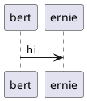
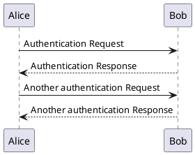
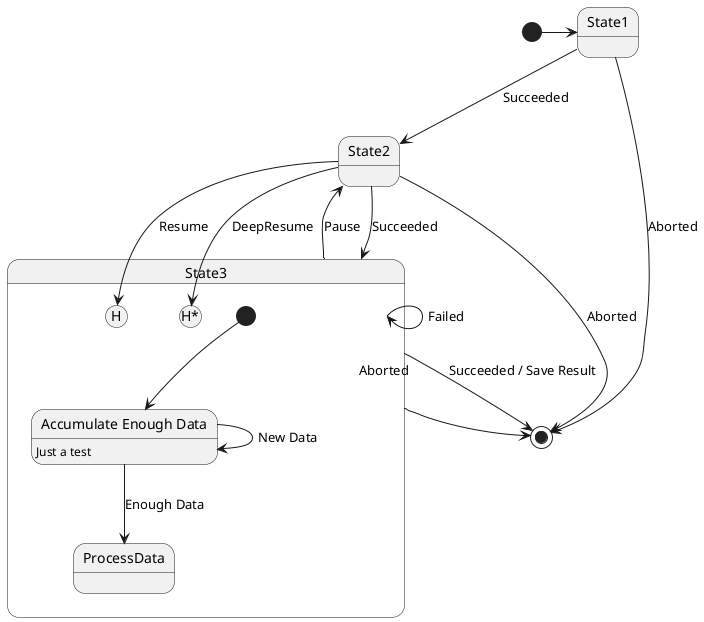

# Chapter 1

Let's add some text.

Have an _italic_ text

Have a **bold** text

Have ~~striped~~ text


```python
for(i = 1):
    strraNGE = 9
```


```plantuml
@startuml
bert -> ernie : hi
@enduml
```

```plantuml
@startuml
Alice -> Bob: Authentication Request
Bob --> Alice: Authentication Response

Alice -> Bob: Another authentication Request
Alice <-- Bob: Another authentication Response
@enduml
```


```plantuml
@startuml
[*] -> State1
State1 --> State2 : Succeeded
State1 --> [*] : Aborted
State2 --> State3 : Succeeded
State2 --> [*] : Aborted
state State3 {
  state "Accumulate Enough Data" as long1
  long1 : Just a test
  [*] --> long1
  long1 --> long1 : New Data
  long1 --> ProcessData : Enough Data
  State2 --> [H]: Resume
}
State3 --> State2 : Pause
State2 --> State3[H*]: DeepResume
State3 --> State3 : Failed
State3 --> [*] : Succeeded / Save Result
State3 --> [*] : Aborted
@enduml
```